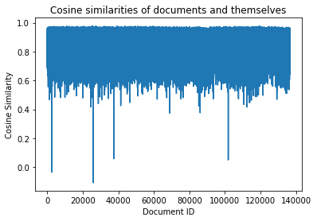

# 电影推荐系统
## 系统架构
本系统采用网站形式进行展示，在服务器端搭建网站访问服务，并且整合推荐算法和数据集，实现信息的处理和展示。

    

在系统架构图中，本系统主要的功能如下：

- 客户端发出页面请求，服务端处理请求，将请求的页面发送回客户端，客户端根据脚本进行页面的展示；
- 客户端发送登录请求，服务端处理请求，进行登录验证。验证成功即登录成功，使客户端可以访问用户相关界面；
- 客户端请求的页面中包含电影信息或请求电影信息，服务端将筛选出符合要求的电影信息数据发送给客户端，客户端通过脚本动态更改页面并展示这些信息；
- 客户端请求的页面中包含用户信息或请求用户信息，服务端将筛选出符合要求的用户信息数据发送给客户端，客户端通过脚本动态更改页面并展示这些信息；
- 客户端请求的页面中包含推荐信息或请求信息推荐，服务端将筛选出指定推荐算法结果数据，结合电影信息数据，发送给客户端，客户端通过脚本动态展示推荐结果。
## 数据集
本系统使用的电影数据集 `Moviedata-10M` 来源于 `Github` 开源爬虫项目 [AntSpider](https://github.com/csuldw/AntSpider)，采集于豆瓣电影，详细信息请参阅该项目介绍。

本系统主要使用了 `movies.csv` 和 `ratings.csv` 两个文件中的数据。
## 项目环境
本实验中与推荐算法相关的实验环境如下：

- 操作系统：Windows 11，版本 21H2；
- 开发环境：python3.9、numpy1.21、pandas1.4、matplotlib3.5、gensim4.1；
- 开发工具：Jupyter Notebook、PyCharm。

本实验中与服务器搭建相关的实验环境如下：

- 操作系统：Ubuntu18.04
- 开发环境：Node.js14.19、csvtojson2.0、express4.18、express-session1.17、json2csv5.0、lunr2.3、lunr-language1.9、nodejieba2.6；
- 开发工具：Vim。
## 算法简介
### Baseline 算法
这一推荐算法将电影评分看作连续的值，即可将推荐问题转化为回归问题，然后预测出用户对电影的评分，根据评分高低进行推荐。

该算法基于以下假设：

- 有些用户的评分普遍高于其他用户，有些用户的评分普遍低于其他用户；
- 有些物品的评分普遍高于其他物品，有些物品的评分普遍低于其他物品。

设评分数据集的平均评分为 $\mu$，用户普遍高于或低于平均值 $\mu$ 的差值为 $b_u$，物品普遍高于或低于平均值 $\mu$ 的差值为 $b_i$，则该算法的目标是寻找出最优的 $b_u$ 和 $b_i$，使得某一用户对某一电影的预测评分 $\hat r_{ui}=\mu+b_u+b_i$ 接近于真实评分。例如，通过 Baseline 算法预测用户 A 对电影 B 的评分：首先计算出整个评分数据集的平均评分 $\mu$ 为 3.5 分；由 Baseline 算法得到的用户 A 的偏置值 $b_u$ 为 -0.5 分，即用户 A 是一个比较苛刻的用户，其评分普遍低于平均评分 0.5 分；由 Baseline 算法得到的电影 B 的偏置值 $b_i$ 为 1.2 分，即电影 B 是一部比较热门且备受好评的电影，其评分普遍高于平均评分 1.2 分；最后得到用户 A 对电影 B 的预测评分为 3.5 + (-0.5) + 1.2 = 4.2 分。

接下来说明如何寻找最优的 $b_u$ 和 $b_i$。对于回归问题，利用预测值和真实值的平方差构建损失函数：
$$
J(b_u,b_i)=\sum_{u,i}(r_{ui}-\hat r_{ui})^2=\sum_{u,i}(r_{ui}-\mu-b_u-b_i)^2
$$
引入 L2 正则化，以避免过拟合现象，损失函数如下：
$$
J(b_u,b_i)=\sum_{u,i}(r_{ui}-\mu-b_u-b_i)^2+\lambda(\sum_u b_u^2+\sum_i b_i^2)
$$
其中，$r_{ui}$ 表示真实值，$\lambda$ 表示正则化系数。因此，寻找最优的 $b_u$ 和 $b_i$ 就是使损失函数最小。

本实验中使用梯度下降法求解该优化问题。根据损失函数可以得到参数 $b_u$ 和 $b_i$ 的更新公式：
$$
b_u:=b_u-\frac{\alpha}{2}\frac{\partial}{\partial b_u}J(b_u,b_i)=b_u+\alpha[\sum_{u,i}(r_{ui}-\mu-b_u-b_i)-\lambda b_u]\\
b_i:=b_i-\frac{\alpha}{2}\frac{\partial}{\partial b_i}J(b_u,b_i)=b_i+\alpha[\sum_{u,i}(r_{ui}-\mu-b_u-b_i)-\lambda b_i]
$$
其中，$\alpha$ 表示学习速率，通过合适的学习速率使参数 $b_u$ 和 $b_i$ 快速收敛到最优值附近。
### 基于用户画像的推荐算法
这一推荐算法的核心是建立用户画像，这里使用 TF-IDF 特征提取技术来提取出电影的特征，即建立起电影画像。再根据用户的观影历史，将所观看的电影的画像标签反打到用户身上。最后通过对用户观影标签的次数进行统计，计算权重，排序后选取前N个作为用户最终的画像标签，从而建立起用户画像。

TF-IDF 算法是自然语言处理领域中计算文档中词语或短语的权值的方法，是词频（Term Frequency，TF）和逆文档频率（Inverse Document Frequency，IDF）的乘积。它基于假设：若一个词语在目标文档中出现的频率高而在其他文档中出现的频率低，那么这个词语就可以用来区分出目标文档。

词频指的是某一给定词语在文档中出现的次数。该数字通常被正则化，以防同一词语在长的文档中比在短的文档中出现次数多，不能体现这一词语的重要性。逆文档频率可以度量一个词语普遍重要性程度，其计算方法是由总文档数目除以包含该词语的文档的数目，再将得到的商取对数，即为这一词语的逆文档频率。

假设文档集包含 $N$ 个文档，文档集中包含关键词 $X_i$ 的文档数为 $n_i$，而关键词 $X_i$ 在文档 $D_j$ 中出现的次数是 $f_{ij}$，文档 $D_j$ 中的词语总数为 $f_j$，那么关键词 $X_i$ 在文档 $D_j$ 中的词频为
$$
TF_{ij}=\frac{f_{ij}}{f_j}
$$
关键词 $X_i$ 的逆文档频率为
$$
IDF_i=\log\frac{N}{n_i}
$$
那么由 TF-IDF 算法计算得到的关键词 $X_i$ 对于文档 $D_j$ 的权重为
$$
w_{ij}=TF_{ij}\times IDF_i=\frac{f_{ij}}{f_j}\log\frac{N}{n_i}
$$
这一数值越高，就说明关键词 $X_i$ 越能区分出文档 $D_j$。因此对于指定文档，对每个关键词计算TF-IDF值，排序后取值最大的前 N 个关键词作为该文档的特征向量，可以用于代表该文档。
在本系统中，将一部电影的类别（GENRES）和标签（TAGS）字段的词语组成一个文档，所有电影组成的文档可以构成一个文档集，通过 TF-IDF 算法就可以得到每一部电影的特征向量以及特征词语的 TF-IDF 值。这里取 TF-IDF 值最大的前30个词语作为特征向量。
### Doc2Vec 算法
Doc2Vec 算法是建立在 Word2Vec 算法上的，用于直接计算以文档为单位的文档向量。本实验中将一部电影的所有画像标签构成一个文档，然后计算出每部电影的向量，通过计算向量之间的距离，来判断电影之间的相似程度，进而实现相似电影的推荐。

首先介绍 Word2Vec 算法，这一算法是将所有的词语向量化表示，通过向量的距离等方法以定量描述词语与词语之间的关系。Word2Vec 算法包括两个重要的模型：连续词袋模型（Continuous Bag of Words，CBOW）和 Skip-Gram 模型。

连续词袋模型会在当前词语的周围创建一个滑动窗口，从“上下文”——即当前词语周围的词语——预测当前词。每个词语都有一个特征向量，经过训练后，这些向量组成新的向量，可以用来预测当前词。CBOW 模型示意图如下图所示。

Skip-Gram 模型与 CBOW 模型相反，即使用一个词语来预测它周围的词语。对于不经常使用的词语，它可以更准确地预测出其他词语。Skip-Gram 模型示意图如下图所示。

Doc2Vec 算法的目标是创建文档的向量化表示。与词语不同，文档并没有词语之间的逻辑结构。解决方案是为 Word2Vec 模型添加一个新的向量，来表示文档，如下图1所示的段落向量的分布式记忆模型（PV-DM）和下图2所示的段落向量的分布式词袋模型（PV-DBOW）。因此，当训练词语向量时，也在训练文档向量，训练结束后即可得到文档的向量化表示。

图1

图2

## GUI 设计
本系统以搭建一个网站的形式进行展示，主要有主页、登录页、用户信息页面、用户推荐页面、电影数据库页面和电影信息展示页面。这些页面的结构均包括左侧侧边栏、顶部栏和中心界面，主要区别在于中心界面的内容。左侧侧边栏固定有主页、用户信息页面、用户推荐页面和电影数据库页面的跳转链接。由于本系统使用了豆瓣电影的数据，所以在侧边栏最下方进行了说明，并给出豆瓣电影的跳转链接。顶部栏包括搜索框和最右侧的头像，搜索框可以用于搜索电影，头像可以跳转到登录页或用户信息页面。

主页页面如下图所示，其中心界面用于展示较为流行的电影的简要信息。

登录页页面如下图所示，其中心界面只展示了一个登录框。

登录后可以访问用户信息页面，如下图所示，其中心界面显示了用户名称和其观影历史及评分记录。

登陆后可以访问用户推荐页面，如下图所示，其中心界面展示了Baseline算法和用户画像推荐算法的结果。

电影数据库页面如下图所示，其中心界面展示了所有电影的简要信息。

电影信息展示页面如下图所示，其中心界面包括剧照、电影的详细信息和相似电影推荐。

## 推荐算法效果分析
由于用户画像推荐算法是根据画像标签的权重来进行推荐，即通过标签在电影画像中的权重表示电影的相关性，标签在用户画像中的权重表示用户的感兴趣程度，两者的乘积来综合这两方面，根据排序顺序进行推荐。因此并未找到一个客观的评价标准。

对于 Baseline 算法，可以用均方根误差（RMSE）和平均绝对差（MAE）来评价算法。这两个数值的计算公式如下：
$$
RMSE=\sqrt{\frac{1}{N}\sum_{i=1}^N(\hat r-r)^2}\\
MAE=\frac{1}{N}\sum_{i=1}^N|\hat r-r|
$$
其中，$N$ 表示样本数目，$\hat r$ 表示预测评分，$r$ 表示真实评分。这两个数值越接近于 0 说明预测值与真实值越接近，即预测越准确。

本系统中最后确定的 Baseline 算法的参数取值为：训练次数为 50 次，学习率为 0.1，正则化系数为 0.1。训练过程中方差和与训练次数的变化情况如下图所示。

从上图可以看出，训练 30 次后，方差和基本趋于稳定，可以判断梯度下降法已经收敛。用训练出的用户偏置和物品偏置得到训练集的均方根误差和平均绝对差分别为 0.74 和 0.56，测试集的均方根误差和平均绝对差分别为 0.86和 0.67。训练集和测试集的均方根误差或者平均绝对差比较接近，说明 Baseline 算法训练得到的模型在本系统中的过拟合现象较小。

由于 Baseline 算法推荐的是预测评分最大的前 N 部电影，对于一名用户，预测评分的高低取决于物品偏置的高低，而物品偏置的高低顺序是不变的。因此，对于不同用户使用 Baseline 算法进行推荐，结果基本相似，可以说这是 Baseline 算法的一个缺陷。

对于 Doc2Vec 算法，使用训练出的模型来预测电影的特征向量和该电影的真实特征向量之间的余弦相似度来评价模型的好坏。设两个向量分别为 $\vec a,\vec b$，这两个向量的余弦相似度的计算公式如下：
$$
\mathrm{CosineSimilarity}=\frac{\vec a\cdot\vec b}{||\vec a||\cdot||\vec b||}
$$
这一数值越接近 1 则表示两个向量越相似。

本系统最后确定的 Doc2Vec 算法的模型参数为：特征向量长度为 100，上下文窗长为 3，最小词频为 10，工作线程为 4，训练 500 次。利用训练好的模型预测每一部电影的特征向量，然后计算这个特征向量和真实特征向量之间的余弦相似度，如下图所示。

从上图可以看出绝大多数电影得到的余弦相似度在 0.6 以上，有很多电影的余弦相似度接近于 1，只有极个别电影的余弦相似度很低甚至为负值。另外，有 64% 的电影预测的最相似的电影是它本身。